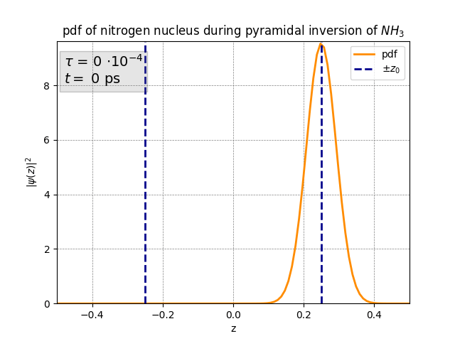
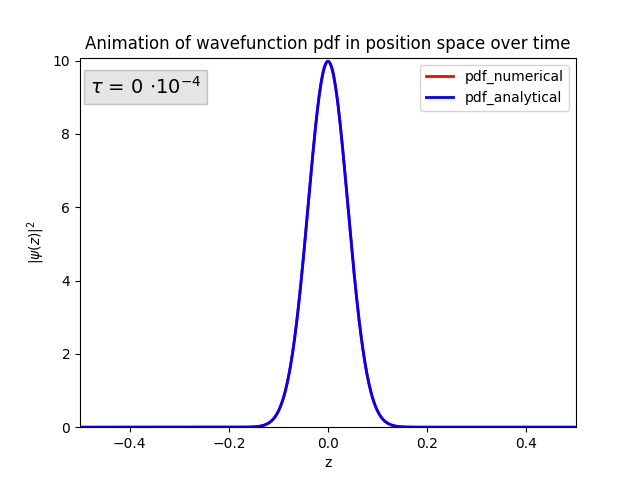
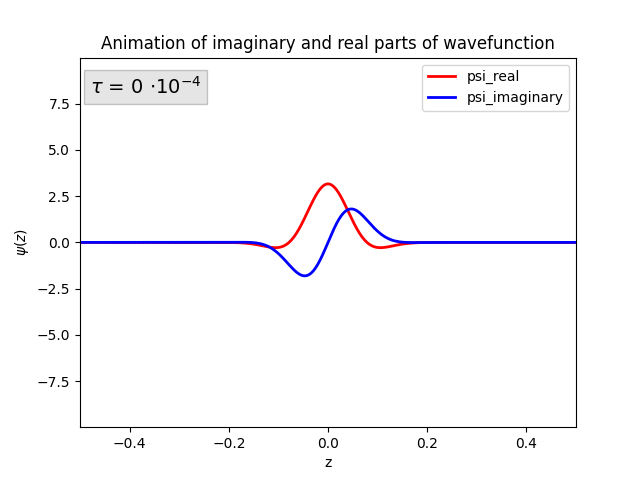

# Numerical Time Evolution & Pyramidal Inversion
(Originally made for an assignment in Quantum Physics class)

This python class allows you to run numerical Schrödinger time evolution on wave functions in varying time-independent potentials using [Crank-Nicolson's method](https://en.wikipedia.org/wiki/Crank%E2%80%93Nicolson_method). There are options to animate the evolution of the wavefunction either as a pdf or as a double plot with imaginary and real parts separated as different colors. You may also plot two separate pdf's at the same time. 

I have also added the functionality to plot analytically solved wave functions as a function of time, either by themselves or at the same time as the numerically solved ones.

If you wish to save your animation you can export them as either .gif or .mp4 files (Note that for mp4-files, FFmpeg is required). 

Various wavefunctions and potentials are already built into the class, including that of an ammonia-molecule which can be used to simulate its pyramidal inversion. I have also added a separate animation option specifically for pyramidal inversion simulations.

Example animations of pyramidal inversion:

 

Example animations of a free particle in an infinite square well:
 

TBC...
